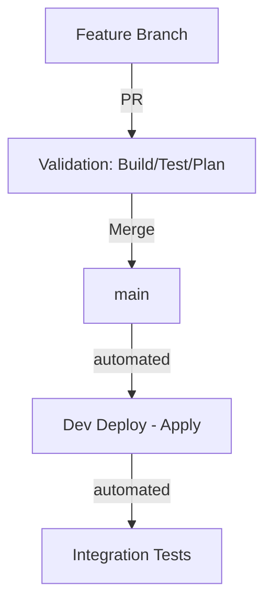
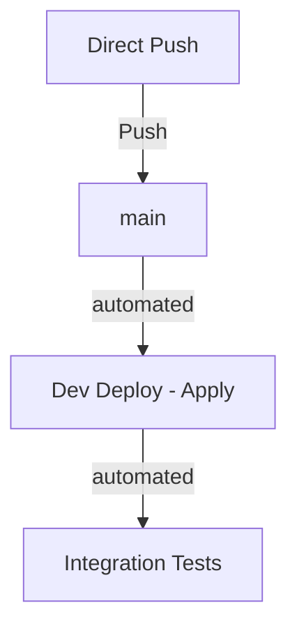

# Contributing Guidelines

## Commit Message Convention

This project uses [Conventional Commits](https://www.conventionalcommits.org/) for automatic versioning and changelog generation.

### Format

```
<type>(<scope>): <description>

[optional body]

[optional footer(s)]
```

### Types

| Type | Description | Version Bump |
|------|-------------|--------------|
| `feat` | New feature | Minor (0.x.0) |
| `fix` | Bug fix | Patch (0.0.x) |
| `docs` | Documentation only | None |
| `style` | Code style (formatting) | None |
| `refactor` | Code refactoring | None |
| `perf` | Performance improvement | Patch |
| `test` | Adding tests | None |
| `chore` | Maintenance tasks | None |
| `ci` | CI/CD changes | None |

### Breaking Changes

Add `!` after type or `BREAKING CHANGE:` in footer for major version bumps:

```
feat!: remove deprecated API endpoint

BREAKING CHANGE: The /v1/jokes endpoint has been removed
```

### Examples

```bash
# Feature
git commit -m "feat(app): add joke categories filter"

# Bug fix
git commit -m "fix(api): handle empty response from Chuck Norris API"

# Documentation
git commit -m "docs: update deployment guide with new secrets"

# Infrastructure
git commit -m "chore(infra): update Cloud Run memory limits"

# Breaking change
git commit -m "feat(api)!: change joke response format"
```

## Pull Request Validation

To ensure stability, every Pull Request targeting the `main` branch undergoes automated validation:

- **Application code (`/app`)**: Triggers a Docker build and unit tests. No image is pushed.
- **Infrastructure code (`/infra`)**: Triggers a `terraform plan` for the `dev` environment to verify changes.

PRs must pass these checks before they can be merged.

## Release Workflow

The project supports two primary development flows:

### 1. Feature Branch / PR Flow (Recommended)
Use this for non-trivial changes or when peer review is required.



### 2. Direct Push Flow
Use this for quick fixes or direct small updates to the development environment.



---

## Branch Strategy

- **`main`**: Development branch. Direct pushes are allowed, but PRs are encouraged for complex changes.
- **Feature branches**: Use for isolated development. Create PRs targeting `main`.

For detailed information on environment triggers, mode of operation, and naming conventions, please refer to the **[Environments & Conventions](docs/architecture.md#environments--conventions)** section in the architecture documentation.
