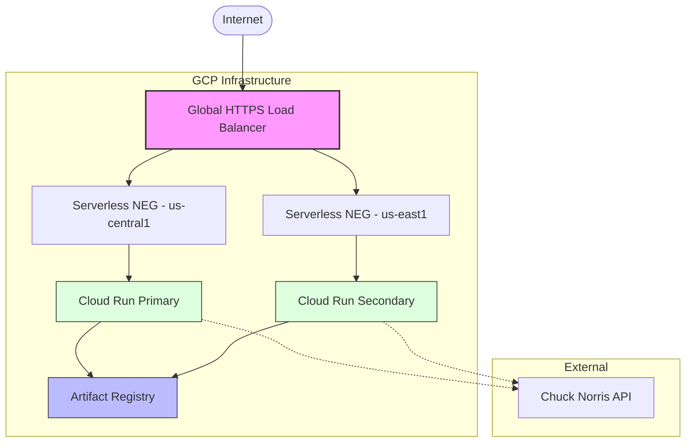

# Architecture Documentation

## System Overview

The Chuck Norris Jokes application is a Python Flask web application deployed to Google Cloud Platform using a multi-region, high-availability architecture.

## Architecture Diagram

## Components

### Application Layer

| Component | Technology | Purpose |
|-----------|------------|---------|
| App Server | Gunicorn | WSGI HTTP server for Python |
| Framework | Flask | Web framework |

### Infrastructure Layer

| Component | GCP Service | Purpose |
|-----------|-------------|---------|
| Container Registry | Artifact Registry | Docker image storage |
| Compute | Cloud Run | Serverless containers |
| Load Balancing | Global HTTP(S) LB | Traffic distribution, SSL termination, HTTP→HTTPS redirect, compression |
| DNS | Cloud DNS (optional) | Domain management |

## Deployment Strategy

The project leverages a **Semi-Automated GitOps** model to ensure high availability and operational control across multiple regions.

For a detailed step-by-step breakdown of the deployment lifecycle, please refer to the **[Deployment Guide](deployment-guide.md)**. For information on the CI/CD pipeline and release workflow, see **[CONTRIBUTING.md](../CONTRIBUTING.md)**.

### Key Principles
- **Revision-based**: Uses Cloud Run's native revision management for safe, split-free traffic shifting.
- **GitOps Driven**: `infra/terraform.tfvars` acts as the source of truth for the active container version.
- **Multi-Region Redundancy**: Traffic is load-balanced across primary and secondary regions.
- **Automated Validation**: Integrated health checks and integration tests run automatically post-deployment.

Manual rollback via:
- Update `image_tag` in `infra/terraform.tfvars` to a previous version.
- `gcloud run services update-traffic` command.

## Environments & Conventions

All resources follow the pattern: `chuck-{environment}`.

| Environment | Trigger | Deployment Mode | Example Resources |
|-------------|---------|-----------------|-------------------|
| **dev** | Push to `main` | Manual Apply | `chuck-dev-primary` |
| **stg** | Tag created (`v*`) | Manual Apply | `chuck-stg-primary` |
| **prod** | Release Promotion | Manual Apply | `chuck-prod-primary` |

Shared resources:
- `chuck-registry` (Artifact Registry, shared across all envs)

## Scaling Configuration

| Environment | Min Instances | Max Instances |
|-------------|---------------|---------------|
| dev | 0 | 2 |
| stg | 0 | 5 |
| prod | 1 | 100 |

Cloud Run automatically scales based on:
- Request concurrency (default: 80)
- CPU utilization
- Memory utilization

## Security

- **Authentication**: Workload Identity Federation (keyless)
- **Network**: HTTPS only, HTTP redirects
- **IAM**: Least privilege service accounts
- **Secrets**: GitHub Secrets, no hardcoded credentials
